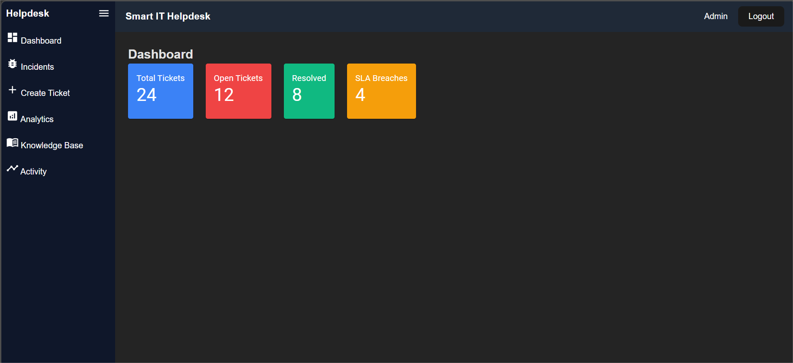
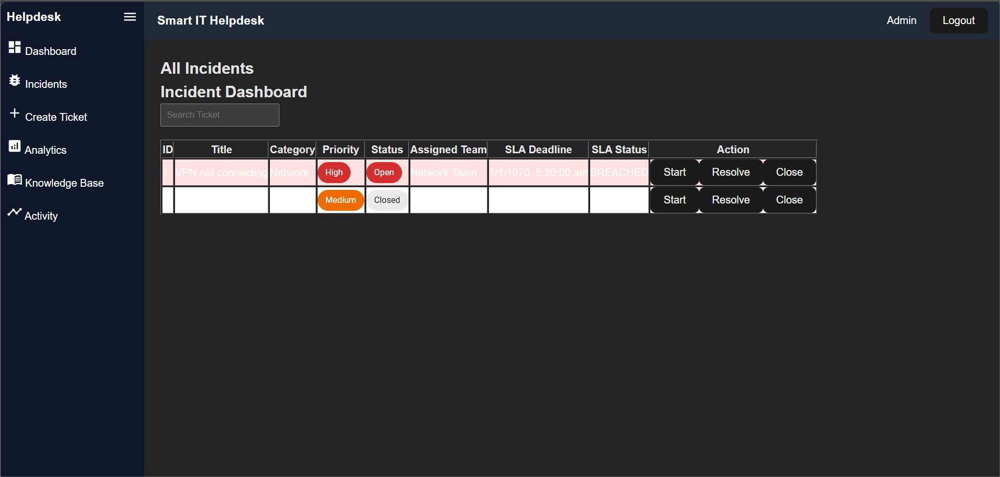
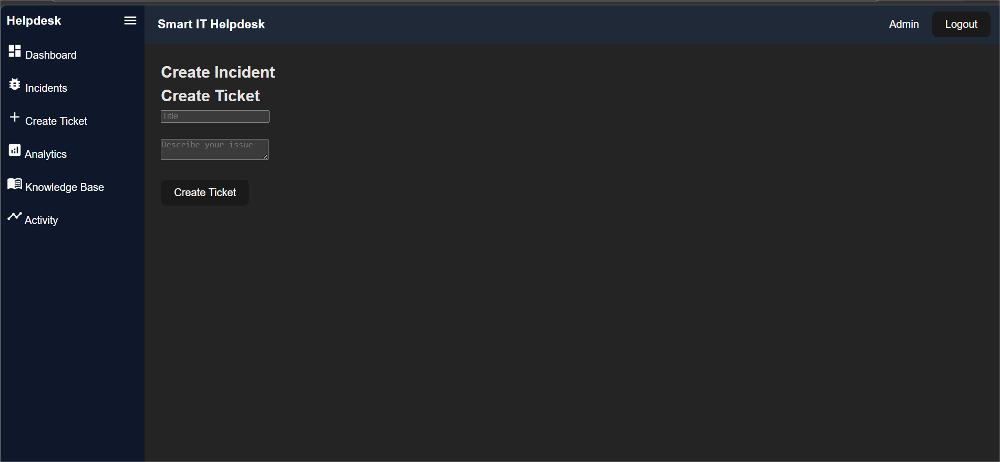
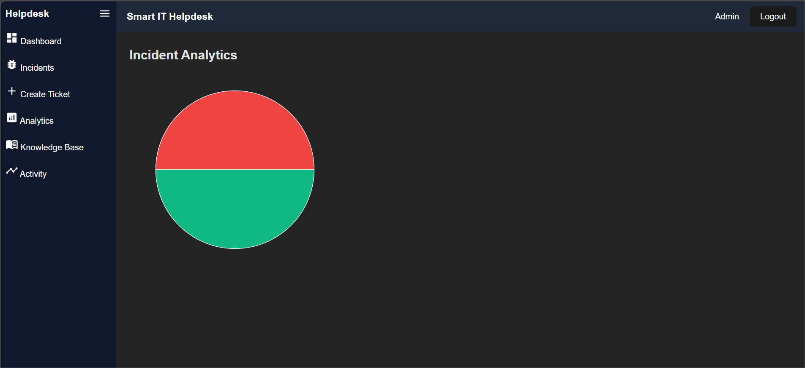
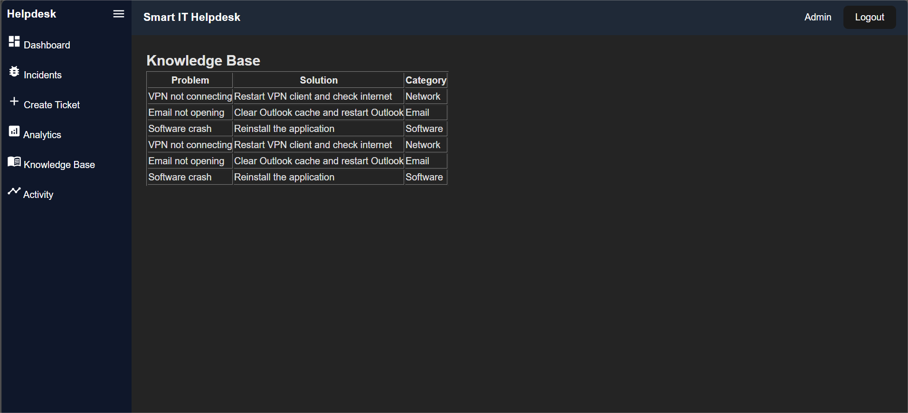
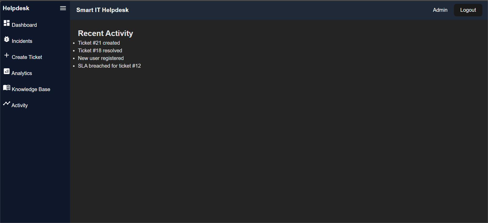

# 🚀 Smart IT Helpdesk System

A **full-stack IT Service Management platform** inspired by modern enterprise tools like ServiceNow.

This system helps organizations manage IT support requests efficiently through **incident tracking, SLA monitoring, analytics dashboards, and knowledge base solutions**.

---

## ✨ Features

🔐 Secure User Authentication (Login & Registration)  
📋 Incident Ticket Creation & Management  
⏱ SLA Monitoring System  
📚 Knowledge Base for Common IT Issues  
📊 Analytics Dashboard with Ticket Insights  
📈 Activity Timeline for System Events  
🌙 Dark / Light Mode UI  
📱 Responsive Dashboard Interface  

---

## 🛠 Tech Stack

**Frontend**

- React
- Material UI
- React Router
- Axios

**Backend**

- Node.js
- Express.js
- REST API

**Database**

- MySQL

---

## 🏗 System Architecture

Frontend (React)  
⬇  
REST API (Node.js + Express)  
⬇  
Database (MySQL)

---

## 📸 Project Screenshots

### Login Page


### Dashboard



### Incident Management


### Create Tickets Dashboard


### Analytics Dashboard


### Knowledge Dashboard


### Activity Dashboard



---

## ⚙ Installation Guide

Clone the repository

```bash
git clone https://github.com/YOUR_USERNAME/smart-it-helpdesk.git